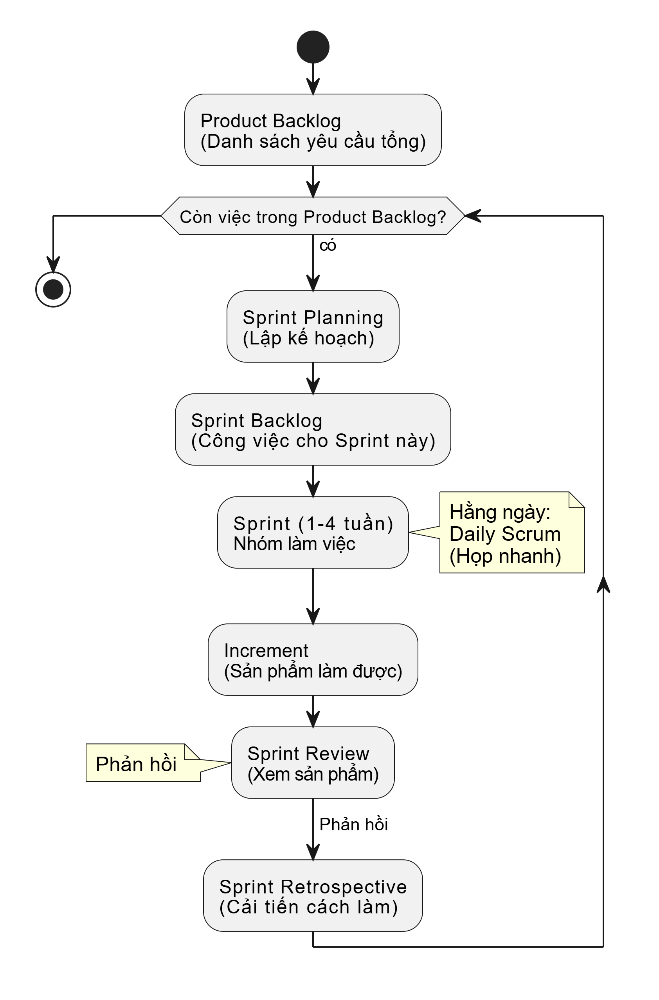

## 4. Tổng quan về Scrum Framework

### 🎯 Mục tiêu phần học

Sau khi học xong phần này, học viên sẽ:

- Hiểu được **Scrum là gì** và tại sao nó lại phổ biến trong phát triển phần mềm.
- Nắm được các **thành phần cốt lõi** của Scrum: Vai trò, Sự kiện và Công cụ (Artifacts).
- Hiểu được **luồng công việc cơ bản** trong một chu kỳ Scrum (Sprint).
- Liên hệ được cách Scrum giúp các nhóm làm việc hiệu quả và linh hoạt hơn.

---

### 🧩 Nội dung chi tiết

#### 4.1. Scrum là gì?

Hãy tưởng tượng bạn và nhóm bạn muốn xây một ngôi nhà đồ chơi phức tạp. Thay vì lập kế hoạch chi tiết từ A-Z rồi mới bắt đầu, các bạn quyết định:

1.  **Chia nhỏ việc:** Xây từng phần một (móng, tường, mái...). Mỗi phần làm trong 1 tuần.
2.  **Họp nhanh mỗi sáng:** Để xem hôm qua làm được gì, hôm nay làm gì, có khó khăn gì không.
3.  **Cuối mỗi tuần:** Cùng xem lại phần đã xây, nhận xét và điều chỉnh kế hoạch cho tuần sau.

**Scrum chính là một cách làm việc giống như vậy!**

Nó **không phải là một quy trình cứng nhắc** mà là một **khung làm việc (framework)** đơn giản, giúp các nhóm giải quyết các vấn đề phức tạp và tạo ra sản phẩm có giá trị cao một cách linh hoạt. Scrum dựa trên tinh thần của Agile Manifesto (đã học ở phần 3).

**Điểm chính của Scrum:**

- **Chia công việc lớn thành các phần nhỏ** có thể hoàn thành trong thời gian ngắn (gọi là **Sprint**).
- **Kiểm tra và điều chỉnh liên tục** thông qua các buổi họp ngắn.
- **Tập trung vào sự hợp tác** trong nhóm và với khách hàng.

#### 4.2. Các thành phần cốt lõi của Scrum

Scrum có 3 trụ cột chính:

**1. Vai trò (Roles):** Ai làm gì?

- **Product Owner (Người chủ sản phẩm):**
  - Là người đại diện cho khách hàng hoặc người dùng cuối.
  - Quyết định **làm cái gì** (tính năng nào quan trọng, cần làm trước).
  - Quản lý danh sách các yêu cầu (gọi là **Product Backlog**).
  - _Ví dụ:_ Giống như người thuyền trưởng quyết định hướng đi của con tàu.
- **Scrum Master (Người điều phối Scrum):**
  - Là người giúp nhóm hiểu và làm theo Scrum đúng cách.
  - Loại bỏ các **khó khăn, trở ngại** mà nhóm gặp phải.
  - Đảm bảo các buổi họp Scrum diễn ra hiệu quả.
  - _Ví dụ:_ Giống như huấn luyện viên giúp đội bóng chơi tốt hơn.
- **Development Team (Nhóm phát triển):**
  - Là nhóm những người trực tiếp **tạo ra sản phẩm** (lập trình viên, kiểm thử viên, thiết kế viên...).
  - Tự quyết định **làm như thế nào** để hoàn thành công việc đã chọn trong mỗi Sprint.
  - Nhóm thường nhỏ (3-9 người) và có đủ kỹ năng cần thiết.
  - _Ví dụ:_ Giống như đội công nhân trực tiếp xây dựng ngôi nhà.

**2. Sự kiện (Events):** Các buổi họp định kỳ

- **Sprint:**
  - Là **chu kỳ làm việc chính**, thường kéo dài từ 1-4 tuần.
  - Trong mỗi Sprint, nhóm sẽ hoàn thành một phần sản phẩm có thể sử dụng được.
  - Giống như một "vòng lặp" công việc.
- **Sprint Planning (Họp kế hoạch Sprint):**
  - Diễn ra vào **đầu Sprint**.
  - Nhóm cùng Product Owner chọn ra các công việc quan trọng nhất từ Product Backlog để làm trong Sprint này (tạo thành **Sprint Backlog**).
  - Lên kế hoạch chi tiết cách thực hiện công việc đó.
- **Daily Scrum (Họp Scrum hàng ngày):**
  - Họp **rất ngắn** (khoảng 15 phút) vào mỗi buổi sáng.
  - Mỗi thành viên trả lời 3 câu hỏi: Hôm qua làm gì? Hôm nay làm gì? Có gặp khó khăn gì không?
  - Mục đích: Giúp cả nhóm nắm tình hình và phối hợp công việc trong ngày.
- **Sprint Review (Họp sơ kết Sprint):**
  - Diễn ra vào **cuối Sprint**.
  - Nhóm trình bày **sản phẩm đã làm được** trong Sprint cho Product Owner và các bên liên quan xem.
  - Thu thập phản hồi để cải tiến sản phẩm.
- **Sprint Retrospective (Họp cải tiến Sprint):**
  - Diễn ra **sau Sprint Review** và trước Sprint Planning tiếp theo.
  - Nhóm cùng nhìn lại **cách làm việc** trong Sprint vừa qua: Cái gì tốt? Cái gì chưa tốt? Cần cải tiến gì cho Sprint sau?
  - Mục đích: Giúp nhóm làm việc hiệu quả hơn theo thời gian.

**3. Công cụ (Artifacts):** Những thứ hữu hình

- **Product Backlog (Danh sách yêu cầu sản phẩm):**
  - Là **danh sách tổng hợp tất cả** các tính năng, yêu cầu, sửa lỗi... mong muốn cho sản phẩm.
  - Product Owner chịu trách nhiệm sắp xếp thứ tự ưu tiên cho danh sách này.
  - Nó **luôn thay đổi** khi có yêu cầu mới hoặc thay đổi.
- **Sprint Backlog (Danh sách công việc Sprint):**
  - Là **danh sách các công việc** mà Nhóm phát triển đã chọn để hoàn thành trong Sprint hiện tại.
  - Bao gồm cả kế hoạch để thực hiện các công việc đó.
- **Increment (Sản phẩm tăng trưởng):**
  - Là **phần sản phẩm hoàn chỉnh**, có thể sử dụng được, được tạo ra sau mỗi Sprint.
  - Mỗi Increment là một bước tiến tới sản phẩm cuối cùng.

#### 4.3. Luồng công việc cơ bản trong Scrum

**Giải thích sơ đồ:**

1.  Bắt đầu từ **Product Backlog** (danh sách lớn).
2.  Trong buổi **Sprint Planning**, nhóm chọn việc và lập kế hoạch, tạo ra **Sprint Backlog**.
3.  Trong suốt **Sprint**, nhóm làm việc để hoàn thành các mục trong Sprint Backlog, có **Daily Scrum** mỗi ngày để đồng bộ.
4.  Kết quả của Sprint là một **Increment** (phần sản phẩm mới).
5.  Cuối Sprint, nhóm trình bày Increment trong **Sprint Review** để nhận phản hồi.
6.  Sau đó, nhóm họp **Sprint Retrospective** để cải tiến quy trình làm việc.
7.  Phản hồi từ Sprint Review có thể cập nhật lại Product Backlog.
8.  Vòng lặp mới (Sprint tiếp theo) lại bắt đầu.

---

### 💬 Giải thích một số từ chuyên ngành trong phần này:

- **Framework (Khung làm việc):** Một bộ quy tắc, ý tưởng, hoặc niềm tin cơ bản mà bạn sử dụng để quyết định cách làm việc gì đó. Nó giống như bộ khung xương, bạn cần thêm "thịt" (các kỹ thuật cụ thể) vào để hoàn chỉnh.
- **Artifact (Công cụ/Hiện vật):** Những thứ hữu hình, nhìn thấy được trong Scrum như Product Backlog, Sprint Backlog, Increment.
- **Increment (Sản phẩm tăng trưởng):** Phần sản phẩm nhỏ nhưng hoàn chỉnh và có thể sử dụng được sau mỗi Sprint. Nó "tăng trưởng" dần qua các Sprint.
- **Backlog:** Một danh sách các công việc cần làm, được sắp xếp theo thứ tự ưu tiên.

---

### 🎯 Case Study: Nhóm làm website giới thiệu khóa học bằng Scrum

> **Tình huống:** Một nhóm sinh viên được giao làm website giới thiệu các khóa học của khoa trong 1 tháng.
>
> **Áp dụng Scrum:**
>
> 1.  **Product Owner (Giảng viên):** Liệt kê các yêu cầu: Trang chủ, trang giới thiệu khoa, danh sách khóa học, chi tiết khóa học, trang liên hệ. Ưu tiên làm trang chủ và danh sách khóa học trước.
> 2.  **Nhóm phát triển (Sinh viên):** Gồm 4 bạn (2 lập trình, 1 thiết kế, 1 viết nội dung).
> 3.  **Scrum Master (Một bạn trong nhóm):** Đảm bảo nhóm theo đúng quy trình Scrum đơn giản.
> 4.  **Sprint 1 (1 tuần):**
>     - _Sprint Planning:_ Nhóm chọn làm Trang chủ và khung sườn cơ bản cho website. Lên kế hoạch chi tiết.
>     - _Daily Scrum:_ Mỗi sáng họp 10 phút xem tiến độ, khó khăn.
>     - _Cuối tuần (Sprint Review):_ Trình bày trang chủ demo cho giảng viên xem. Giảng viên góp ý về màu sắc, bố cục.
>     - _Sprint Retrospective:_ Nhóm thấy việc trao đổi qua chat hơi chậm, quyết định Sprint sau sẽ ngồi chung nhiều hơn.
> 5.  **Sprint 2 (1 tuần):**
>     - _Sprint Planning:_ Chọn làm trang Danh sách khóa học, áp dụng góp ý từ Sprint 1.
>     - ... (tiếp tục quy trình) ...
>
> **Kết quả:** Sau 4 Sprint (4 tuần), nhóm hoàn thành website đúng hạn, sản phẩm bám sát yêu cầu của giảng viên nhờ các phản hồi liên tục sau mỗi Sprint.

---

### 🧠 Câu hỏi thảo luận gợi mở

- Bạn thấy vai trò nào trong Scrum là thú vị nhất? Tại sao?
- Theo bạn, việc họp Daily Scrum mỗi ngày có thực sự cần thiết không? Lợi ích và khó khăn là gì?
- So với cách làm việc truyền thống (lập kế hoạch chi tiết từ đầu), bạn nghĩ Scrum có ưu điểm gì nổi bật?

---

### 📌 Tài liệu & Tham khảo

- **Scrum Guide (Hướng dẫn Scrum):** https://scrumguides.org (Có bản tiếng Việt)
- Sách “Scrum: The Art of Doing Twice the Work in Half the Time” – Jeff Sutherland
- https://www.atlassian.com/agile/scrum
